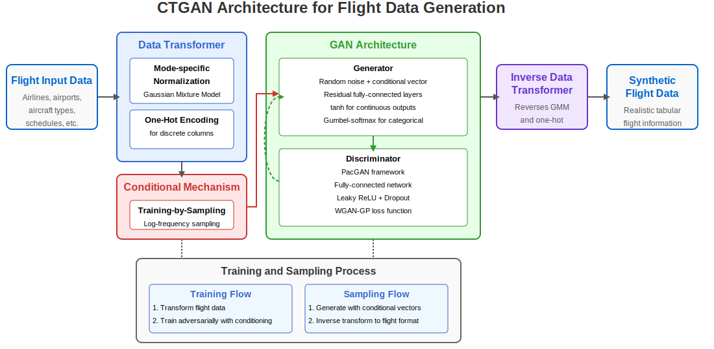
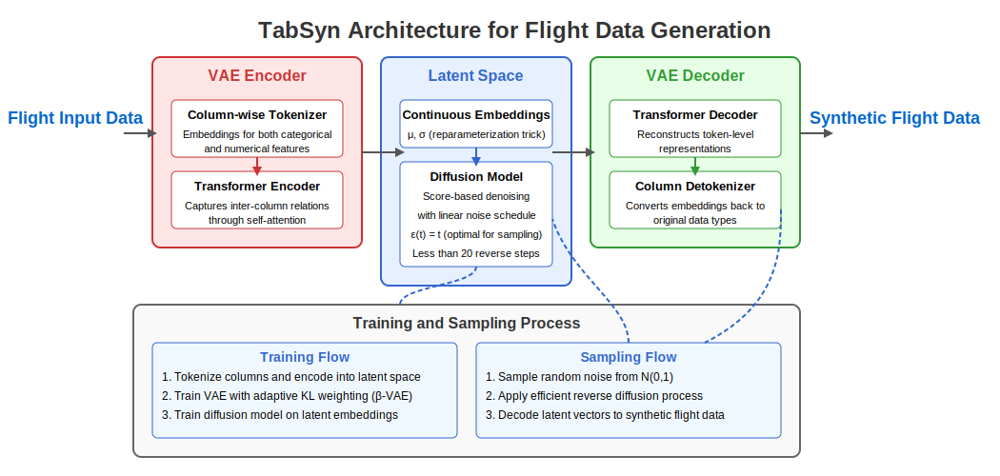
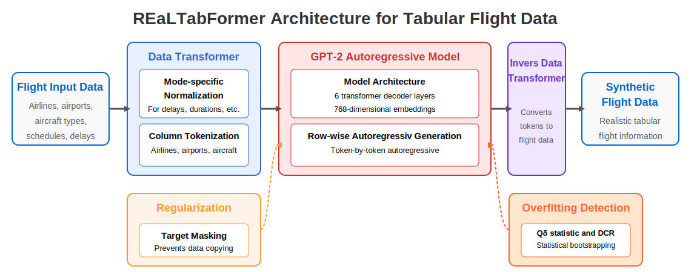

# Tabular Synthetic Data Generation for Air Traffic Management

This repository provides state-of-the-art tabular data generation models specifically optimized for aviation data. It contains implementations of multiple synthetic data generators designed to create realistic flight records while preserving statistical properties, maintaining privacy, and ensuring utility for downstream prediction tasks.

## Overview

This toolkit addresses critical challenges in the aviation industry by providing synthetic data generation capabilities across two use cases:

1. **Turnaround Time Prediction**: Generate high-fidelity synthetic data for aircraft ground operations
2. **Delay Prediction**: Create realistic synthetic datasets for arrival and departure delay analysis


The repository offers a complete pipeline from data preprocessing through model training, generation, and comprehensive evaluation across fidelity, privacy, and utility dimensions.

## Models Implemented

This repository implements four synthetic data generation approaches specifically adapted for aviation data:

1. **GaussianCopula**: A statistical model that captures dependencies between flight variables while preserving marginal distributions

2. **CTGAN (Conditional Tabular GAN)**: A GAN-based approach for mixed-type tabular flight data with mode-specific normalization  
   <div align="center">
     
     <br>
     <em>Figure 1: CTGAN Architecture for Flight Data Generation.</em>
   </div>

3. **TabSyn**: A two-stage approach that combines VAE representation learning with diffusion-based generation in latent space  
   <div align="center">
     
     <br>
     <em>Figure 2: TabSyn Architecture for Flight Data Generation.</em>
   </div>

4. **REaLTabFormer**: A transformer-based model that treats flight records as sequences of tokens for autoregressive generation  
   <div align="center">
     
     <br>
     <em>Figure 3: REaLTabFormer Architecture for Flight Data Generation.</em>
   </div>

Each model has been optimized for the unique characteristics of aviation data, capturing complex relationships between airports, airlines, aircraft types, and temporal patterns.


## Repository Structure

```
├── LICENSE                  # CC BY-SA 4.0 License
├── NOTICE                   # Attributions and acknowledgments
├── pyproject.toml           # Project dependencies and metadata
├── README.md                # Project documentation (this file)
├── scripts/                 # Executable scripts for training, generation, and evaluation
│   ├── evaluate_fidelity.py # Script for statistical similarity assessment
│   ├── evaluate_privacy.py  # Script for privacy risk assessment
│   ├── evaluate_utility.py  # Script for downstream prediction performance
│   ├── generate_with_*.py   # Scripts for generating synthetic flight data
│   ├── plot_*.py            # Scripts for visualizing evaluation results
│   ├── prepare_data.py      # Script for processing raw flight data
│   └── train_*.py           # Scripts for training generative models
└── src/                     # Source code for the SynTabAIr library
    └── syntabair/           # Main package
        ├── evaluation/      # Evaluation metrics and utilities
        │   ├── fidelity/    # Statistical similarity metrics
        │   ├── privacy/     # Privacy protection metrics
        │   └── utility/     # Predictive utility metrics
        ├── generators/      # Tabular data generation models
        │   ├── copula/      # GaussianCopula implementation
        │   ├── ctgan/       # CTGAN implementation
        │   ├── rtf/         # REaLTabFormer implementation
        │   └── tabsyn/      # TabSyn implementation
        └── preprocessing/   # Data preprocessing utilities
            └── flight_data.py # Flight data preprocessing utilities
```

## Installation and Setup

### System Requirements

- Python 3.10 or newer (supports up to Python 3.13)
- CUDA-compatible GPU (recommended for training CTGAN, TabSyn, and RTF models)
- At least 16GB RAM (32GB+ recommended for larger datasets)
- Sufficient disk space for storing models and synthetic datasets

### Installation

1. Install Poetry (if not already installed):
   ```bash
   curl -sSL https://install.python-poetry.org | python3 -
   ```

2. Clone the repository:
   ```bash
   git clone https://github.com/SynthAIr/tabsynthr.git
   cd tabsynthr
   ```

3. Install dependencies with Poetry:
   ```bash
   poetry install
   ```

4. Activate the virtual environment:
   ```bash
   poetry shell
   ```

5. Verify installation:
   ```bash
   python -c "import syntabair; print('Installation successful!')"
   ```

For GPU support, ensure appropriate CUDA drivers and libraries are installed according to your hardware specifications.

## Data Preparation

### Preprocessing Flight Data

The repository includes comprehensive tools for processing flight data from sources like OAG's Flight Info Direct and BTS databases. These scripts handle:

- Data cleaning and filtering
- Feature extraction for carrier, airport, and aircraft information
- Temporal processing of scheduled and actual timestamps
- Delay and turnaround time calculation
- Train/test splitting for evaluation

To prepare flight data for analysis and modeling:

```bash
python scripts/prepare_data.py \
  --input_path data/flights.csv \
  --output_train_path data/real/train.csv \
  --output_test_path data/real/test.csv \
  --test_size 0.2 \
  --random_state 42
```

### Data Format

The processed flight data contains essential aviation-specific columns such as:
- Carrier codes and flight identifiers
- Origin and destination airports
- Aircraft type
- Scheduled and actual timestamps for departure and arrival
- Departure and arrival delays
- Turnaround time and flight duration

Additional derived features include day of week, time-of-day components, and scheduled vs. actual duration differences.

## Model Training

The repository supports training four different synthetic data generation models, each with aviation-specific adaptations:

### 1. GaussianCopula (Statistical Model)

No explicit training script (fits directly during generation)

### 2. CTGAN (Conditional Tabular GAN)

```bash
python scripts/train_ctgan.py \
  --data_path data/real/train.csv \
  --model_path models/ctgan.pkl \
  --batch_size 500 \
  --epochs 500 \
  --sample_size 10000 \
  --random_state 42 \
  --device cuda
```

### 3. TabSyn (Diffusion-based Model)

```bash
python scripts/train_tabsyn.py \
  --train_path data/real/train.csv \
  --model_dir models/tabsyn \
  --vae_epochs 200 \
  --diffusion_epochs 1000 \
  --embedding_dim 4 \
  --vae_lr 1e-3 \
  --diffusion_lr 3e-4 \
  --batch_size 8192 \
  --device cuda
```

### 4. REaLTabFormer (Transformer-based Model)

```bash
python scripts/train_rtf.py \
  --data_path data/real/train.csv \
  --model_dir models/rtf_model \
  --epochs 50 \
  --batch_size 64 \
  --sample_size 10000 \
  --random_state 42 \
  --device cuda
```

## Synthetic Data Generation

Once models are trained, synthetic flight data can be generated with various configuration options:

### GaussianCopula

```bash
python scripts/generate_with_copula.py \
  --train_data_path data/real/train.csv \
  --output_path data/synthetic/copula.csv \
  --random_state 42 \
  --batch_size 10000
```

### CTGAN

```bash
python scripts/generate_with_ctgan.py \
  --model_path models/ctgan.pkl \
  --output_path data/synthetic/ctgan.csv \
  --reference_data_path data/real/train.csv
```

### TabSyn

```bash
python scripts/generate_with_tabsyn.py \
  --model_dir models/tabsyn \
  --output_path data/synthetic/tabsyn.csv \
  --steps 50
```

### REaLTabFormer

```bash
python scripts/generate_with_rtf.py \
  --model_path models/rtf_model \
  --output_path data/synthetic/rtf.csv \
  --reference_data_path data/real/train.csv \
  --device cuda
```

## Evaluation Framework

The repository provides a comprehensive evaluation framework across three dimensions specifically tailored for aviation data:

### 1. Fidelity Evaluation

```bash
python scripts/evaluate_fidelity.py \
  --real_test_path data/real/test.csv \
  --synthetic_paths data/synthetic/copula.csv data/synthetic/ctgan.csv data/synthetic/tabsyn.csv data/synthetic/rtf.csv \
  --synthetic_names GaussianCopula CTGAN TabSyn REaLTabFormer \
  --metrics all \
  --output_dir results/fidelity
```

Measures how well synthetic flight data preserves the statistical properties of the original data, including:
- Marginal distributions of flight characteristics
- Correlations between flight parameters
- Joint distributions of related variables
- Detection resistance against classifiers

For detailed fidelity evaluation results on our EU flight data, including comprehensive statistical similarity metrics and visualizations, see our [complete fidelity analysis](results/fidelity.md).

### 2. Privacy Evaluation

```bash
python scripts/evaluate_privacy.py \
  --real_train_path data/real/train.csv \
  --real_validation_path data/real/test.csv \
  --synthetic_paths data/synthetic/copula.csv data/synthetic/ctgan.csv data/synthetic/tabsyn.csv data/synthetic/rtf.csv \
  --synthetic_names GaussianCopula CTGAN TabSyn REaLTabFormer \
  --output_dir results/privacy \
  --metrics all \
  --sample_size 100000 \
  --num_iterations 3
```

Evaluates privacy protection by measuring:
- Distance to closest record (DCR) between synthetic and real flight data
- Resistance to memorization of training data
- Protection against record reconstruction attacks

For detailed privacy evaluation results on our synthetic flight data, including DCR baseline and overfitting protection analyses, see our [comprehensive privacy assessment](results/privacy.md).

### 3. Utility Evaluation

```bash
python scripts/evaluate_utility.py \
  --real_train_path data/real/train.csv \
  --real_test_path data/real/test.csv \
  --synthetic_paths data/synthetic/copula.csv data/synthetic/ctgan.csv data/synthetic/tabsyn.csv data/synthetic/rtf.csv \
  --synthetic_names GaussianCopula CTGAN TabSyn REaLTabFormer \
  --output_dir results/utility \
  --targets DEPARTURE_DELAY_MIN ARRIVAL_DELAY_MIN TURNAROUND_MIN \
  --prediction_modes pre-tactical tactical
```

Assesses the usefulness of synthetic flight data for ATM prediction tasks:
- Pre-tactical prediction: Using only scheduled information
- Tactical prediction: Using real-time operational data
- Evaluating machine learning model performance across multiple targets:
  - Departure delay prediction
  - Arrival delay prediction
  - Turnaround time prediction

For detailed utility evaluation results on our EU flight data, including TSTR performance metrics and feature importance analyses across all prediction tasks, see our [complete utility analysis](results/utility.md).

### Visualization

Generate visualizations from evaluation results:

```bash
# For fidelity plots
python scripts/plot_fidelity.py \
  --results_path results/fidelity/fidelity_results.csv \
  --output_dir results/fidelity/plots \
  --metrics all

# For privacy plots
python scripts/plot_privacy.py \
  --results_dir results/privacy \
  --output_dir results/privacy/plots \
  --plot_types all

# For utility plots
python scripts/plot_utility.py \
  --results_dir results/utility \
  --output_dir results/utility/plots
```

## Complete Example Workflow

Here's a complete workflow from data preparation to evaluation:

```bash
# 1. Prepare data
python scripts/prepare_data.py --input_path data/flights.csv --output_train_path data/real/train.csv --output_test_path data/real/test.csv

# 2. Train models
python scripts/train_ctgan.py --data_path data/real/train.csv --model_path models/ctgan.pkl --epochs 500
python scripts/train_tabsyn.py --train_path data/real/train.csv --model_dir models/tabsyn
python scripts/train_rtf.py --data_path data/real/train.csv --model_dir models/rtf_model

# 3. Generate synthetic data
python scripts/generate_with_copula.py --train_data_path data/real/train.csv --output_path data/synthetic/copula.csv
python scripts/generate_with_ctgan.py --model_path models/ctgan.pkl --output_path data/synthetic/ctgan.csv --reference_data_path data/real/train.csv
python scripts/generate_with_tabsyn.py --model_dir models/tabsyn --output_path data/synthetic/tabsyn.csv
python scripts/generate_with_rtf.py --model_path models/rtf_model --output_path data/synthetic/rtf.csv --reference_data_path data/real/train.csv

# 4. Evaluate results
python scripts/evaluate_fidelity.py --real_test_path data/real/test.csv --synthetic_paths data/synthetic/copula.csv data/synthetic/ctgan.csv data/synthetic/tabsyn.csv data/synthetic/rtf.csv --synthetic_names GaussianCopula CTGAN TabSyn REaLTabFormer --metrics all --output_dir results/fidelity
python scripts/evaluate_privacy.py --real_train_path data/real/train.csv --real_validation_path data/real/test.csv --synthetic_paths data/synthetic/copula.csv data/synthetic/ctgan.csv data/synthetic/tabsyn.csv data/synthetic/rtf.csv --synthetic_names GaussianCopula CTGAN TabSyn REaLTabFormer --output_dir results/privacy --metrics all
python scripts/evaluate_utility.py --real_train_path data/real/train.csv --real_test_path data/real/test.csv --synthetic_paths data/synthetic/copula.csv data/synthetic/ctgan.csv data/synthetic/tabsyn.csv data/synthetic/rtf.csv --synthetic_names GaussianCopula CTGAN TabSyn REaLTabFormer --output_dir results/utility --targets DEPARTURE_DELAY_MIN ARRIVAL_DELAY_MIN TURNAROUND_MIN --prediction_modes pre-tactical tactical

# 5. Generate plots
python scripts/plot_fidelity.py --results_path results/fidelity/fidelity_results.csv --output_dir results/fidelity/plots --metrics all
python scripts/plot_privacy.py --results_dir results/privacy --output_dir results/privacy/plots --plot_types all
python scripts/plot_utility.py --results_dir results/utility --output_dir results/utility/plots
```

## Attributions and Acknowledgments

This repository is part of the SynthAIr project that has received funding from the SESAR Joint Undertaking under grant agreement No 101114847 under European Union's Horizon 2020 research and innovation programme.

The implementation builds upon several foundational research papers and implementations:

- **CTGAN**: Based on "Modeling Tabular Data using Conditional GAN" by Xu et al.
- **TabSyn**: Based on "Mixed-Type Tabular Data Synthesis with Score-based Diffusion in Latent Space" by Zhang et al.
- **REaLTabFormer**: Based on "REaLTabFormer: Generating Realistic Relational and Tabular Data using Transformers" by Solatorio and Dupriez
- **Gaussian Copula**: Based on "On Default Correlation: A Copula Function Approach" by Li

### Code Adaptations

The repository incorporates code adapted from several open-source projects:

1. **TabSyn** (https://github.com/amazon-science/tabsyn) by Amazon Science
2. **REaLTabFormer** (https://github.com/worldbank/REaLTabFormer) by The World Bank
3. **CTGAN** (https://github.com/sdv-dev/CTGAN) by DataCebo, Inc.
4. **Copulas** (https://github.com/sdv-dev/Copulas) by DataCebo, Inc.
5. **SDMetrics** (https://github.com/sdv-dev/SDMetrics) by MIT Data To AI Lab

All adapted code contains attribution notices acknowledging the original source and license.

## License

This repository is licensed under the Creative Commons Attribution-ShareAlike 4.0 International License (CC BY-SA 4.0).

The repository incorporates components with various licenses:
- TabSyn: Apache License 2.0
- REaLTabFormer: MIT License
- CTGAN & Copulas: Business Source License 1.1
- SDMetrics: MIT License

Users should consult the full license texts for specific use cases, particularly for commercial applications.