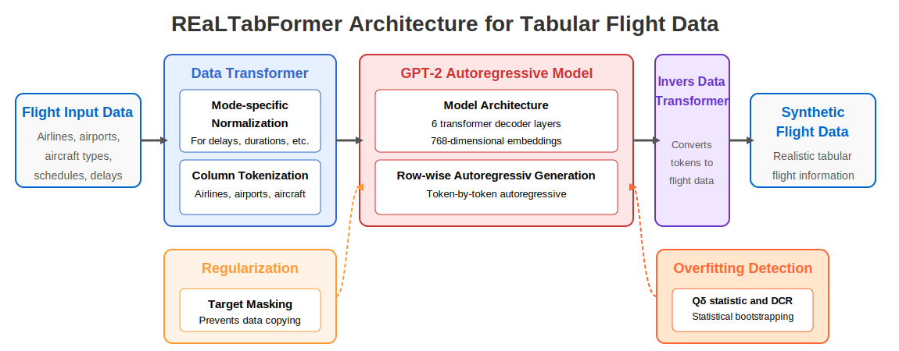

# Appendix: Generative Models

This appendix provides detailed architectural specifications, training procedures, and implementation details for each of the four synthetic data generation models evaluated in this study.

---

## 1. Gaussian Copula (GC)

A statistical approach that models multivariate dependencies by separating marginal distributions from their dependence structure. This method is particularly suited for mixed-type tabular data, handling both categorical (airports, carriers, aircraft types) and continuous (delays, turnaround times) variables through a unified framework.

The Gaussian copula model operates in two stages:

### Marginal Distribution Fitting

For each variable $X_i$ in the dataset, we fit an appropriate univariate distribution. For continuous variables, the implementation employs a flexible selection mechanism that evaluates multiple candidate distributions (e.g., Gaussian, exponential, beta) using the Kolmogorov-Smirnov test, automatically selecting the best-fitting model. Categorical variables are encoded using ordinal encoding, preserving their discrete nature while enabling numerical processing.

### Dependency Modeling

After fitting marginals, we transform each variable to the standard normal domain using:

$$Z_i = \Phi^{-1}(F_i(X_i))$$

where $F_i$ is the fitted CDF for variable $i$ and $\Phi^{-1}$ is the inverse standard normal CDF. The transformation clips extreme values to $[\epsilon, 1-\epsilon]$ to ensure numerical stability.

The correlation structure is then captured by computing the correlation matrix $\mathbf{R}$ of the transformed variables $\{Z_1, ..., Z_d\}$. For random variables $X_1, X_2, \ldots, X_d$ with marginal CDFs $F_1, F_2, \ldots, F_d$, let $u_i = F_i(X_i)$ represent the probability integral transforms. The joint distribution is then modeled using the Gaussian copula:

$$C_{\mathbf{R}}(u_1, ..., u_d) = \Phi_{\mathbf{R}}(\Phi^{-1}(u_1), ..., \Phi^{-1}(u_d))$$

where $\Phi_{\mathbf{R}}$ represents the CDF of a multivariate normal distribution with correlation matrix $\mathbf{R}$.

### Synthetic Data Generation

To generate new samples:

1. Sample $\mathbf{z} \sim \mathcal{N}(\mathbf{0}, \mathbf{R})$ from the multivariate normal
2. Transform to uniform: $u_i = \Phi(z_i)$ for each component
3. Apply inverse marginal CDFs: $x_i = F_i^{-1}(u_i)$
4. For categorical variables, round to nearest valid category index and decode

This approach preserves parametrically-fitted marginal distributions while capturing linear correlations between variables. However, it may struggle with complex non-linear dependencies and rare event combinations that are particularly important in aviation operations.

---

## 2. Conditional Tabular GAN (CTGAN)

CTGAN [1] is a generative adversarial network specifically designed for mixed-type tabular data, addressing the unique challenges of generating realistic flight records with both continuous (delays, durations) and categorical (airports, carriers) variables.

  
   
  <em>Figure: CTGAN Architecture for Flight Data Generation. The diagram illustrates the complete pipeline for synthetic flight data generation. Starting with flight input data (left), the system transforms it using mode-specific normalization for continuous variables and one-hot encoding for discrete columns like airline codes and airports. The conditional mechanism employs training-by-sampling with log-frequency to address category imbalance. The GAN architecture consists of a generator (combining random noise with conditional vectors) and discriminator (using PacGAN and WGAN-GP loss). Finally, the inverse data transformer converts the generator's output back into realistic flight data format, preserving the complex statistical relationships present in the original data.</em>

### Architecture Overview

As illustrated in the figure above, CTGAN consists of four interconnected components that transform raw flight data into a generative model capable of producing new synthetic samples:

### 1. Data Transformer

The first component in the pipeline preprocesses mixed-type data for neural network processing:

**Mode-specific Normalization**: For continuous variables, employs a Bayesian Gaussian Mixture Model (BGM) to identify multimodal distributions:
- Fits a BGM with up to 10 components using variational inference
- Each value is represented as: (1) normalized scalar within its mode, and (2) one-hot vector indicating the mode
- Prevents gradient vanishing in non-Gaussian distributions common in flight delays

**One-hot Encoding**: Categorical variables (airlines, airports, aircraft types) are encoded as one-hot vectors

### 2. Conditional Mechanism

The conditional component addresses severe category imbalance in aviation data:

**Training-by-Sampling**: Uses log-frequency sampling to ensure rare categories receive adequate training:

$$P(c_i) = \frac{\log(f_i) + 1}{\sum_j (\log(f_j) + 1)}$$

where $f_i$ is the frequency of category $i$

**Conditional Vector**: Generator receives a one-hot vector indicating which discrete column/value to generate, enabling balanced learning across all categories

### 3. GAN Architecture

The core generative components consist of:

**Generator Network:**

- **Architecture**: Two residual blocks with batch normalization and ReLU activation
  - Input: Random noise (128-dim) concatenated with conditional vector
  - Hidden layers: 256 neurons each with residual connections
  - Output: Mixed activations - tanh for normalized values, Gumbel-softmax for categories

- **Residual Block Structure**:
  $$\text{Residual}(x) = \text{Concat}[\text{ReLU}(\text{BN}(\text{FC}(x))), x]$$

**Discriminator Network:**

- **PacGAN Framework**: Processes 10 samples jointly to prevent mode collapse
- **Architecture**: Two hidden layers (256 neurons) with LeakyReLU ($\alpha$=0.2) and dropout (0.5)
- **WGAN-GP Loss**: Wasserstein loss with gradient penalty:
  $$\mathcal{L}_D = -(\mathbb{E}[D(\text{real})] - \mathbb{E}[D(\text{fake})]) + \lambda \cdot GP$$

  where the gradient penalty term:
  $$GP = \mathbb{E}_{\hat{x}} \left[ (||\nabla_{\hat{x}} D(\hat{x})||_2 - 1)^2 \right]$$

  with $\hat{x}$ interpolated between real and fake samples, and $\lambda = 10$

### 4. Inverse Data Transformer

The final component reverses the initial transformations to produce flight data in its original format.

### Training Methodology

The training process follows these steps:

1. **Data Preprocessing**: Transform data using mode-specific normalization and one-hot encoding

2. **Adversarial Training Loop**:
   - Sample conditional vectors based on log-frequency
   - Select real data matching the condition
   - Generate fake samples: $G(z, c)$ where $z \sim \mathcal{N}(0, I)$ and $c$ is the condition
   - Update discriminator with WGAN-GP loss
   - Update generator with combined loss:
     $$\mathcal{L}_G = -\mathbb{E}[D(G(z,c))] + \mathcal{L}_{\text{cond}}$$
     where $\mathcal{L}_{\text{cond}}$ is cross-entropy between generated categories and condition

### Implementation Details

- Optimizers: Adam with learning rate $2 \times 10^{-4}$, $\beta_1 = 0.5$, $\beta_2 = 0.9$
- Weight decay: $10^{-6}$ for regularization
- Batch size: 500 samples
- Training epochs: 300-500 (determined by loss convergence)
- Discriminator updates per generator update: 1
- Gumbel-softmax temperature: 0.2 for discrete outputs

### Generation Process

1. For conditional generation: specify discrete column and value
2. Create conditional vector from specified condition
3. Sample Gaussian noise: $z \sim \mathcal{N}(0, I_{128})$
4. Concatenate noise with conditional vector
5. Pass through generator to produce normalized outputs
6. Apply inverse data transformation to recover original data format

This architecture enables CTGAN to effectively handle the mixed-type nature of flight data while addressing common challenges such as mode collapse and training instability through its specialized components.

---

## 3. TabSyn

TabSyn [2] addresses the challenge of synthesizing mixed-type tabular data by decoupling representation learning from sample generation. Rather than applying diffusion directly to raw columns—an approach that struggles with complex inter-column dependencies and often requires thousands of sampling steps—TabSyn implements a two-stage pipeline: first mapping data to a continuous latent space via a Variational Autoencoder (VAE), then applying score-based diffusion in this regularized embedding space.

  
   
  <em>Figure: TabSyn architecture for flight data generation. The model employs a two-stage pipeline with three main components: (1) VAE Encoder (left, red) transforms mixed-type flight records into continuous latent vectors through column-wise tokenization and transformer-based encoding; (2) Latent Space Diffusion (center, blue) applies score-based denoising with a linear noise schedule, enabling efficient sampling in 20-50 steps; (3) VAE Decoder (right, green) reconstructs synthetic flight records through transformer decoding and column-specific detokenization.</em>

### Architecture Overview

As illustrated in the figure above, TabSyn consists of three integrated components that work together to transform raw flight data into high-quality synthetic records:

### 1. VAE Encoder Module

The encoder transforms raw flight data into continuous latent representations through two stages:

**Column-wise Tokenizer**: Processes each column independently based on its data type. For numerical attributes (e.g., flight duration, delays), a linear transformation maps values to token embeddings. For categorical attributes (e.g., aircraft type, airports), learned embedding lookup tables transform each category into dense vectors. The combined token dimension is set to 8 for aviation datasets.

**Transformer Encoder**: After tokenization, embeddings are processed through a 2-layer transformer with single-head attention. This architecture captures non-linear relationships between flight attributes through self-attention mechanisms with a hidden dimension expansion factor of 32. The encoder outputs distribution parameters $(\mu, \sigma)$ for each input record, from which latent vectors are sampled using the reparameterization trick.

### 2. Latent Space Diffusion Module

The diffusion component operates entirely in the continuous latent space:

**Forward Process**: Gradually corrupts latent vectors by adding Gaussian noise following a linear schedule, which has been shown to be optimal for this latent space formulation.

**Denoising Network**: A 3-layer MLP with SiLU activations and 1024 hidden dimensions learns to reverse the diffusion process. The network incorporates positional embeddings to encode the noise level at each step. Training minimizes the Elucidating Diffusion Model (EDM) loss:

$$\mathcal{L}_{\text{EDM}} = \mathbb{E}_{z_0, t, \epsilon} \left[ \lambda(t) \|s_\theta(z_t, t) - \epsilon\|_2^2 \right]$$

where $z_t$ is the noisy latent at time $t$, $s_\theta$ is the denoising network, and $\lambda(t)$ is a weighting function derived from the noise schedule.

**Efficient Sampling**: The linear noise schedule enables generation with only 20-50 reverse diffusion steps, compared to thousands required by traditional diffusion approaches operating in data space.

### 3. VAE Decoder Module

The decoder mirrors the encoder structure to reconstruct tabular data:

**Transformer Decoder**: Processes sampled latent vectors through 2 transformer layers with identical configuration to the encoder, maintaining learned interdependencies while reconstructing token-level representations.

**Column Detokenizer**: Maps token representations back to original data types using linear projections for numerical attributes and softmax layers for categorical attributes, ensuring type-appropriate reconstruction.

### Training Methodology

TabSyn employs a sequential two-phase training process:

**Phase 1 - VAE Training:**

The VAE is trained end-to-end with an adaptive KL-divergence weighting:

$$\mathcal{L}_{\text{VAE}} = \mathcal{L}_{\text{recon}} + \beta(t) \cdot \mathcal{L}_{\text{KL}}$$

where:
- Reconstruction loss combines MSE for numerical features and cross-entropy for categorical features
- $\beta(t)$ follows an adaptive schedule: initialized at $10^{-2}$, decaying to $10^{-5}$ with factor 0.7 every 5 epochs if above minimum
- Training runs for 200 epochs with Adam optimizer (learning rate $10^{-3}$) and batch size 8192

**Phase 2 - Diffusion Model Training:**

- The pre-trained VAE encoder (with frozen weights) generates latent embeddings for all training data
- Embeddings are normalized by subtracting mean and scaling by factor 2
- The MLP diffusion model trains for 1000 epochs with learning rate $3 \times 10^{-4}$
- Early stopping with patience of 500 epochs based on validation loss

### Generation Process

1. Sample initial noise: $z_T \sim \mathcal{N}(0, I)$ matching VAE latent dimensions
2. Apply discretized reverse SDE for $T$ steps (typically 50):
   $$z_{t-1} = z_t - \sigma_t(\sigma_t - \sigma_{t-1}) \cdot s_\theta(z_t, \sigma_t)$$
3. Scale and shift final $z_0$ to match training embedding distribution
4. Pass through VAE decoder to obtain synthetic tabular records

This architecture enables TabSyn to capture complex dependencies in mixed-type aviation data while maintaining computational efficiency through its latent space formulation, making it practical for generating large-scale synthetic flight datasets.

---

## 4. REaLTabFormer

REaLTabFormer [3] leverages transformer architectures originally designed for natural language processing to generate synthetic tabular data. Unlike traditional tabular generators that process columns independently, REaLTabFormer treats each flight record as a sequence of tokens, enabling the model to capture complex dependencies between features through autoregressive generation.

  
   
  <em>Figure: REaLTabFormer architecture for tabular flight data generation. The pipeline consists of four main components: (1) Data Transformer applies mode-specific normalization for continuous variables and column tokenization for categorical fields; (2) GPT-2 Autoregressive Model with 6 transformer decoder layers generates flight records row-by-row, token-by-token; (3) Regularization component implements target masking to prevent memorization; (4) Overfitting Detection uses Qδ statistic and Distance to Closest Record (DCR) measurements to ensure model quality. The Inverse Data Transformer converts generated tokens back into structured flight data format.</em>

### Architecture Overview

As illustrated in the figure above, REaLTabFormer consists of four interconnected components that transform flight data into token sequences and generate new records through autoregressive prediction:

### 1. Data Transformer

The data transformer preprocesses mixed-type flight data into tokenized representations:

**Mode-specific Normalization**: For continuous variables (delays, durations, scheduled times):
- Applies text-based representation strategies tailored to each data type
- Numeric values undergo precision-controlled string conversion and are split into fixed-length substrings (default single-character tokens)
- Datetime columns are converted to Unix timestamps, shifted by column mean to reduce scale, then processed through the numeric pipeline

**Column Tokenization**: For categorical variables (airlines, airports, aircraft types):
- Creates column-specific vocabulary mappings
- Preserves unique value distributions within each categorical column
- Enables the model to learn column-specific patterns and constraints

### 2. GPT-2 Autoregressive Model

The core generative component uses a GPT-2 architecture optimized for tabular data:

**Model Configuration:**
- 6 transformer decoder layers (DistilGPT-2 scale)
- 768-dimensional embeddings with 12 attention heads
- Special token handling for sequence boundaries ([BOS], [EOS]) and missing values
- Maximum position embeddings adjusted to accommodate the longest tokenized records

**Row-wise Generation**: Each flight record is treated as a sequence where:
- Tokens are generated left-to-right, conditioned on all previous tokens
- The model learns to predict $P(x_i | x_1, ..., x_{i-1})$ for each token position
- This autoregressive approach naturally captures dependencies between features

### 3. Regularization Mechanism

The regularization component prevents overfitting and memorization:

**Target Masking**: Randomly replaces 10% of tokens with [RMASK] tokens during training. This forces the model to learn contextual relationships rather than memorizing exact patterns. The mask rate parameter controls regularization strength.

### 4. Overfitting Detection

The monitoring system ensures generation quality:

**Qδ Statistic**: Measures dissimilarity between synthetic and real data distributions:

$$Q_\delta = \frac{1}{N}\sum_{q} |p_q - q|$$

where $q$ is a quantile in the evaluation set and $p_q$ is the proportion of synthetic samples below the value at quantile $q$

**Distance to Closest Record (DCR)**: Evaluates whether synthetic samples are copies of training data

**Statistical Bootstrapping**: Establishes data-specific thresholds through 500 bootstrap rounds. Training stops when the statistic breaches its threshold in consecutive checks.

### Training Methodology

1. **Data Preprocessing**: Transform flight data using mode-specific strategies for continuous variables and tokenization for categorical columns
2. **Vocabulary Construction**: Build column-specific vocabularies with special tokens
3. **Autoregressive Training**: Train the model to predict next token given previous tokens:
   $$\mathcal{L} = -\sum_{i=1}^{n} \log P(x_i | x_1, ..., x_{i-1})$$
4. **Overfitting Monitoring**: Evaluate Qδ statistic every 5 epochs and save checkpoints at optimal points

### Generation Process

1. Initialize with beginning-of-sequence token [BOS]
2. For each position in the sequence:
   - Feed current sequence through the model
   - Apply column-aware token constraints to ensure valid domain values
   - Sample next token from the constrained output distribution
3. Continue until end-of-sequence token [EOS] is generated
4. Process generated token sequences through inverse data transformer
5. Reconstruct numerical values from partitioned tokens and convert categorical tokens to original representations

### Implementation Details

- **Training Configuration**: Batch size 64 with gradient accumulation steps of 4 (effective batch size 256), learning rate $2 \times 10^{-4}$ with AdamW optimizer
- **Tokenization Strategy**: Single-character partitioning for numerical values provides fine-grained control during generation
- **Constrained Generation**: Column-aware token filtering prevents generation of invalid values (e.g., non-existent airport codes)
- **Early Stopping**: Bootstrap-based thresholds with patience of 2 consecutive evaluations above threshold

The architecture's strength lies in its ability to model tabular data as sequences, leveraging the proven capabilities of transformer architectures while incorporating domain-specific constraints and regularization techniques to ensure high-quality synthetic flight data generation.

---

## References

[1] Xu, L., Skoularidou, M., Cuesta-Infante, A., & Veeramachaneni, K. (2019). Modeling tabular data using conditional GAN. *Advances in Neural Information Processing Systems*, 32.

[2] Zhang, H., Joshi, H., & Srivastava, A. (2024). Mixed-type tabular data synthesis with score-based diffusion in latent space. *arXiv preprint arXiv:2310.09656*.

[3] Solatorio, A. V., & Dupriez, O. (2023). REaLTabFormer: Generating realistic relational and tabular data using transformers. *arXiv preprint arXiv:2302.02041*.
