# Fidelity Evaluation of Synthetic Flight Data

## Table of Contents
- [Fidelity Evaluation of Synthetic Flight Data](#fidelity-evaluation-of-synthetic-flight-data)
  - [Table of Contents](#table-of-contents)
  - [Executive Summary](#executive-summary)
  - [Introduction to Fidelity Metrics](#introduction-to-fidelity-metrics)
  - [Statistical Similarity Metrics](#statistical-similarity-metrics)
    - [Kolmogorov-Smirnov Complement](#kolmogorov-smirnov-complement)
    - [Chi-Squared Test](#chi-squared-test)
  - [Correlation Preservation Metrics](#correlation-preservation-metrics)
    - [Pearson Correlation](#pearson-correlation)
    - [Spearman and Kendall Correlation](#spearman-and-kendall-correlation)
    - [Correlation Matrix Distance](#correlation-matrix-distance)
    - [Mixed-Type Correlation](#mixed-type-correlation)
  - [Distribution Similarity Metrics](#distribution-similarity-metrics)
    - [Continuous KL Divergence](#continuous-kl-divergence)
    - [Discrete KL Divergence](#discrete-kl-divergence)
  - [Likelihood-based Metrics](#likelihood-based-metrics)
    - [Bayesian Network Log Likelihood](#bayesian-network-log-likelihood)
    - [Gaussian Mixture Log Likelihood](#gaussian-mixture-log-likelihood)
  - [Detection-based Metrics](#detection-based-metrics)
    - [Logistic Regression Detection](#logistic-regression-detection)
  - [Comprehensive Fidelity Analysis](#comprehensive-fidelity-analysis)
    - [Aggregated Scores by Category](#aggregated-scores-by-category)
    - [Radar Chart Comparison](#radar-chart-comparison)
  - [Conclusions \& Recommendations](#conclusions--recommendations)
    - [Key Findings](#key-findings)
    - [Recommendations for Practitioners](#recommendations-for-practitioners)

## Executive Summary

We evaluated four synthetic flight data generators (GaussianCopula,CTGAN, TabSyn and REaLTabFormer) using a comprehensive suite of fidelity metrics. The results show that **REaLTabFormer** consistently delivers the highest fidelity across most metrics, with **TabSyn** as a close second.

## Introduction to Fidelity Metrics

Fidelity in synthetic data refers to how accurately the synthetic data reflects the statistical properties, relationships, and patterns present in the real data. High-fidelity synthetic data can serve as a reliable proxy for real data in analytics, model training, and application testing. Our evaluation examines five key dimensions of fidelity:

1. **Statistical Similarity**: How well individual column distributions match the real data
2. **Correlation Preservation**: How accurately relationships between columns are maintained
3. **Distribution Similarity**: How well joint distributions across multiple columns are preserved
4. **Likelihood Assessment**: How probable the synthetic data would be under models fitted to real data
5. **Detection Resistance**: How difficult it is to distinguish synthetic from real data

All metrics (except raw log-likelihoods) are on a [0–1] scale where higher values indicate better fidelity.

## Statistical Similarity Metrics

### Kolmogorov-Smirnov Complement

The KS Complement metric evaluates how well the synthetic data preserves the distribution of individual continuous variables. It uses the complement of the Kolmogorov-Smirnov statistic, which measures the maximum distance between the empirical cumulative distribution functions (CDFs) of real and synthetic data.
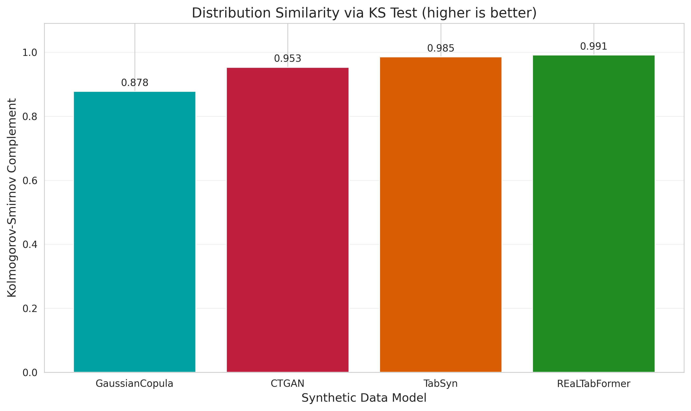

**Results Analysis:**
- **REaLTabFormer** achieves the highest score (0.991), indicating nearly perfect preservation of continuous variable distributions
- **TabSyn** follows with 0.985
- **CTGAN** scores 0.833
- **GaussianCopula** scores 0.878

### Chi-Squared Test
The Chi-Squared Test evaluates how well the synthetic data preserves the distribution of categorical variables. Higher values indicate that the synthetic categorical data follows similar frequency distributions to the real data.
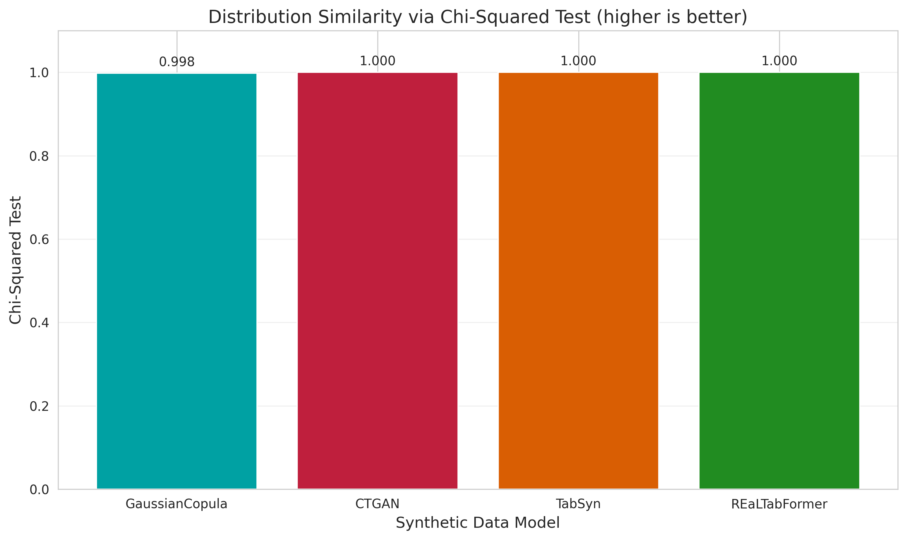

**Results Analysis:**
- **REaLTabFormer**, **TabSyn**, and **CTGAN** each achieve p-values of ~1.000, showing virtually identical categorical distributions to the real data
- **GaussianCopula** scores 0.998, also indicating excellent categorical fidelity

## Correlation Preservation Metrics

### Pearson Correlation
Pearson Correlation evaluates how well the linear relationships between numerical variables are preserved in the synthetic data.

**Results Analysis:**
- Almost all synthetic data generators achieve high Pearson correlation scores, approximately 0.99.

### Spearman and Kendall Correlation
Spearman and Kendall correlations measure how well monotonic (rank-based) relationships are preserved, which is important for capturing non-linear dependencies.

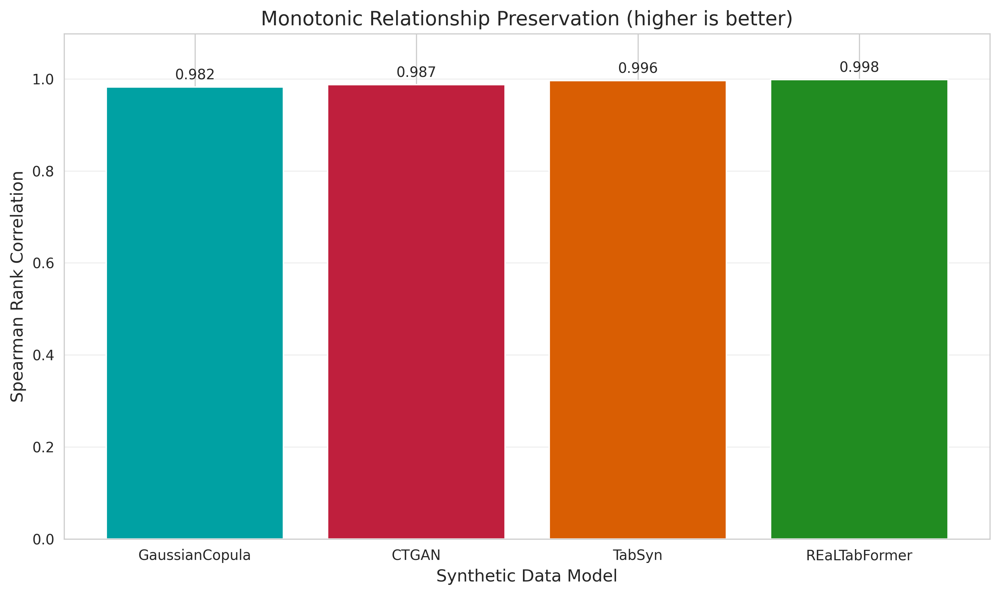  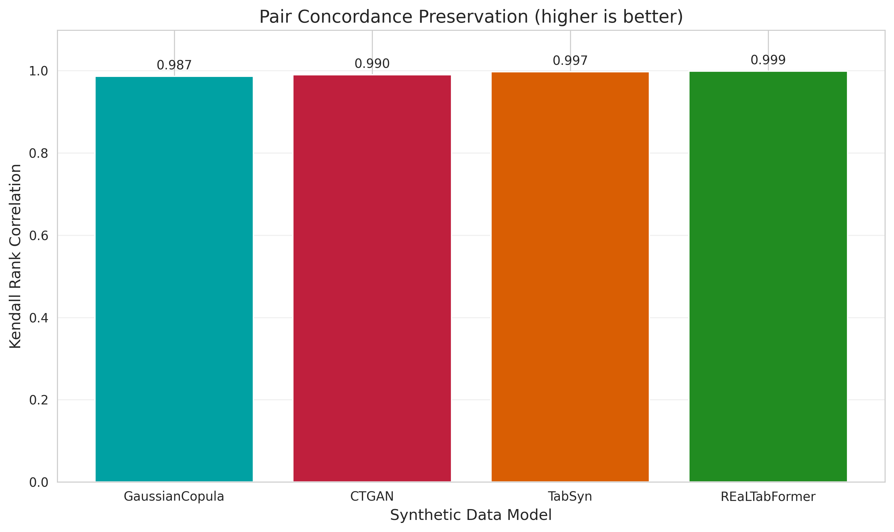

**Results Analysis:**
- All models perform well, achieving scores around 0.99 for Spearman and Kendall correlations.

### Correlation Matrix Distance
This metric computes how similar the overall correlation structure of the synthetic data is to the real data, using the Frobenius norm of the difference between correlation matrices.
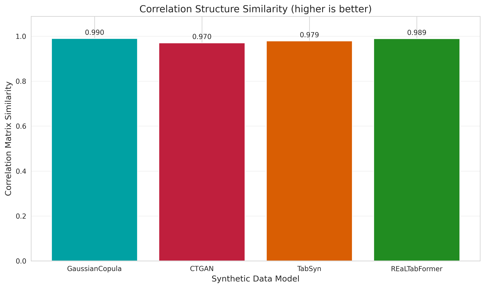

**Results Analysis:**
- All models achieve high scores, around 0.98, indicating strong preservation of correlation structures.

### Mixed-Type Correlation
Mixed-Type Correlation evaluates how well relationships between different types of variables (numerical-categorical, categorical-categorical) are preserved.

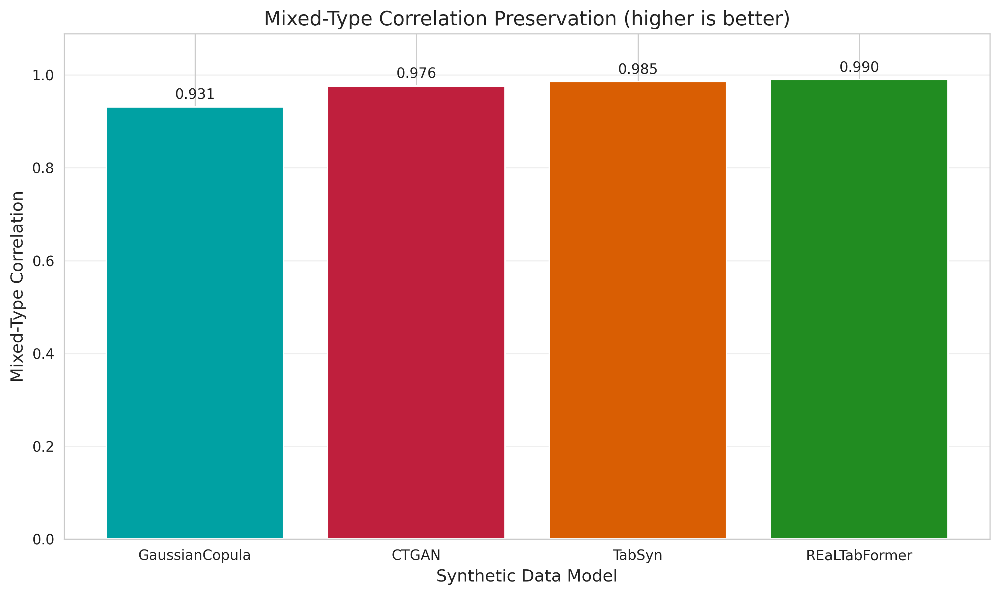

**Results Analysis:**
- **REaLTabFormer** leads at 0.99
- **TabSyn** scores 0.98
- **CTGAN** follows at 0.97
- **GaussianCopula** scores 0.93

## Distribution Similarity Metrics

### Continuous KL Divergence
Continuous KL Divergence measures how well joint distributions of continuous variables are preserved, based on the Kullback-Leibler divergence between multivariate distributions.

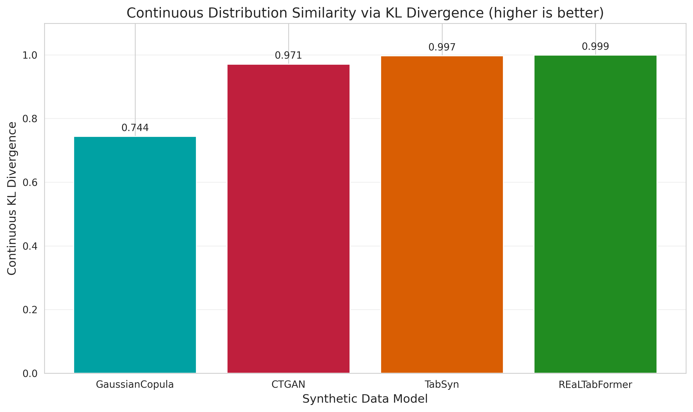

**Results Analysis:**
- **REaLTabFormer**: 0.999
- **TabSyn**: 0.997
- **CTGAN**: 0.971
- **GaussianCopula**: 0.744

### Discrete KL Divergence
Discrete KL Divergence measures how well joint distributions of categorical variables are preserved.

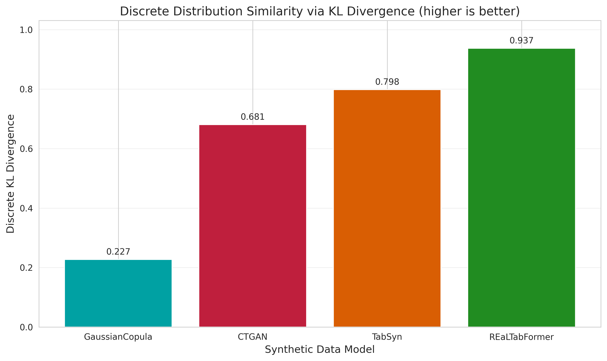

**Results Analysis:**
- **REaLTabFormer**: 0.937
- **TabSyn**: 0.798
- **CTGAN**: 0.681
- **GaussianCopula**: 0.227

## Likelihood-based Metrics

### Bayesian Network Log Likelihood

BN Log Likelihood evaluates how probable the synthetic data would be under a Bayesian Network model fitted to the real data, focusing on discrete and categorical variables.

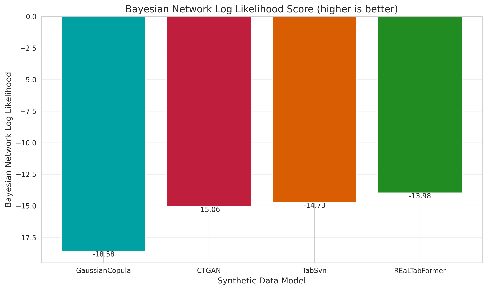

**Results Analysis (average log‐likelihood):**
- **REaLTabFormer**: –13.98 (highest)
- **TabSyn**: –14.73
- **CTGAN**: –15.06
- **GaussianCopula**: –18.58 (lowest)

### Gaussian Mixture Log Likelihood
GM Log Likelihood evaluates how probable the synthetic data would be under a Gaussian Mixture model fitted to the real data, focusing on continuous variables.

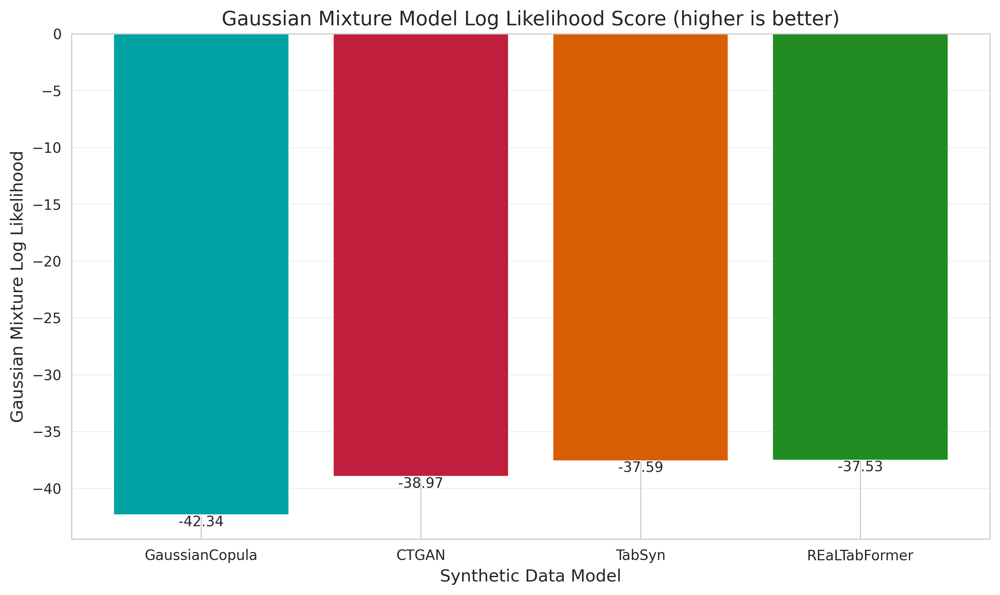

**Results Analysis (average log‐likelihood):**
- **REaLTabFormer**: –37.53 (highest)
- **TVAE**: –37.59
- **CTGAN**: –38.97
- **GaussianCopula**: –42.34 (lowest)

## Detection-based Metrics

### Logistic Regression Detection

Logistic Detection measures how difficult it is for a logistic regression classifier to distinguish between real and synthetic data. Higher scores mean the synthetic data is less distinguishable from real data.

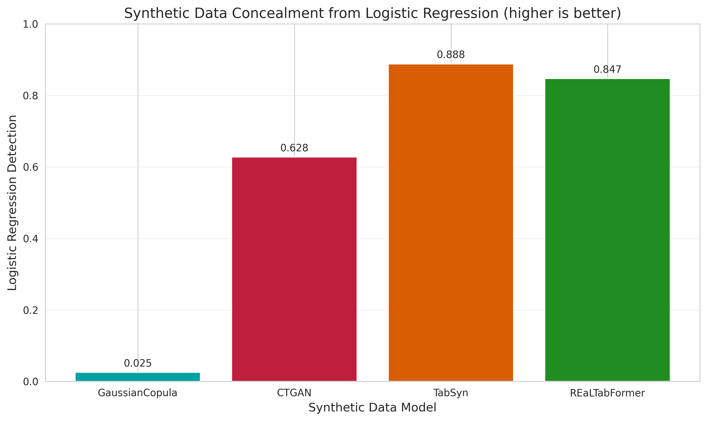

**Results Analysis (1 – AUC):**
- **TabSyn**: 0.888 (hardest to distinguish)
- **REaLTabFormer**: 0.847
- **CTGAN**: 0.628
- **GaussianCopula**: 0.025 (easiest to distinguish)

## Comprehensive Fidelity Analysis

### Overall Heatmap Comparison

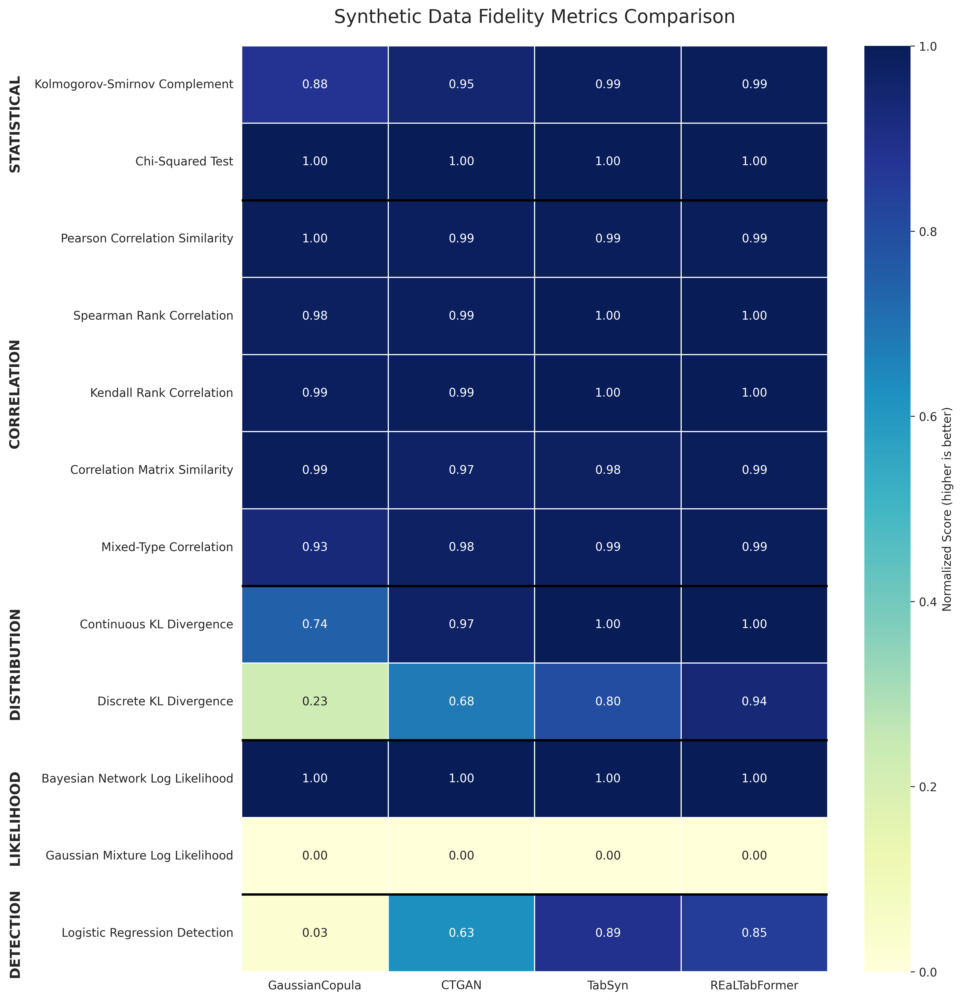

The heatmap confirms that **Realtabformer** and **GaussianCopula** excel at preserving correlation structures and statistical tests, while **Realtabformer** also outperforms in distribution, likelihood, and detection metrics.

### Aggregated Scores by Category

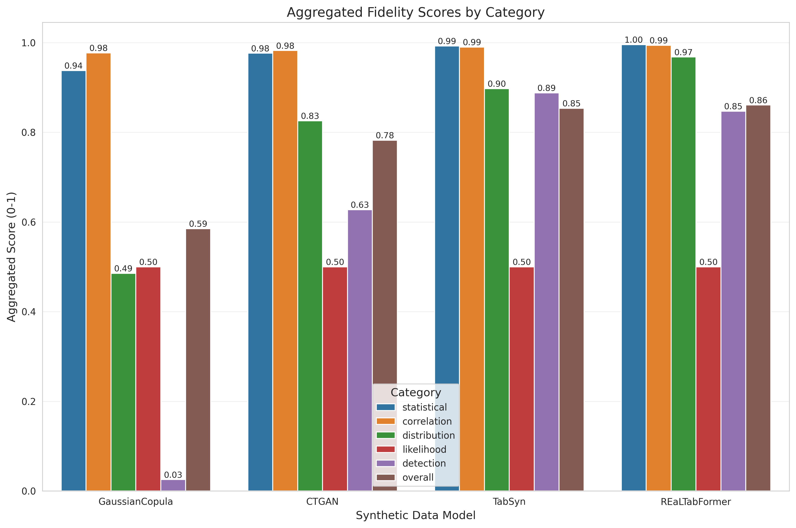

Across metric categories, **Realtabformer** leads overall, followed by **CTGAN**, with **TVAE** and **GaussianCopula** trailing, particularly on detection and distribution metrics.

### Radar Chart Comparison

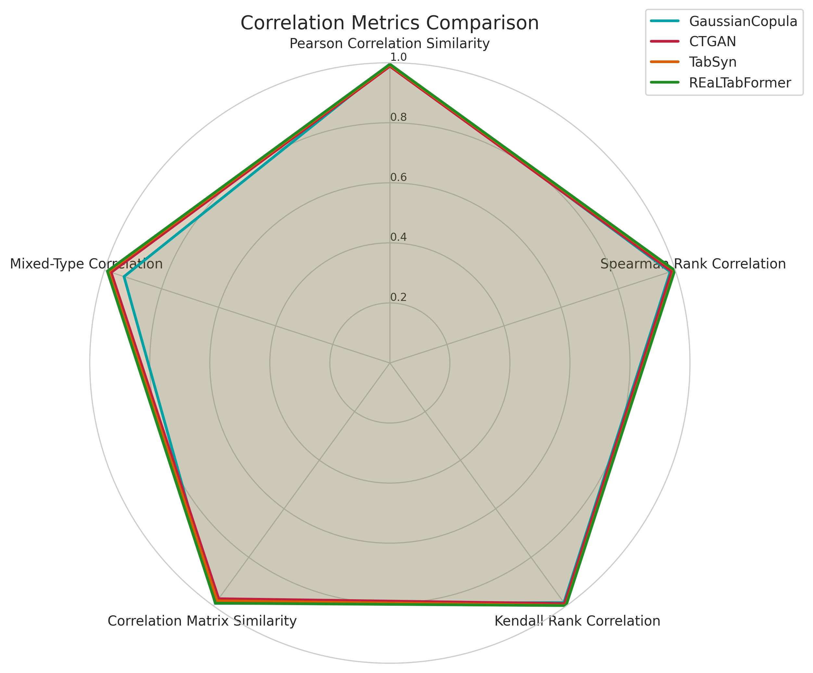

