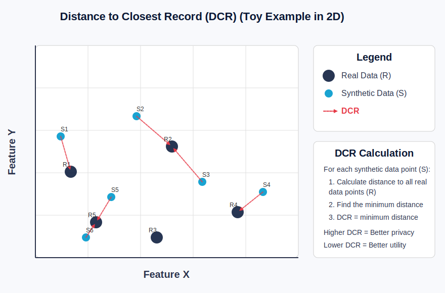
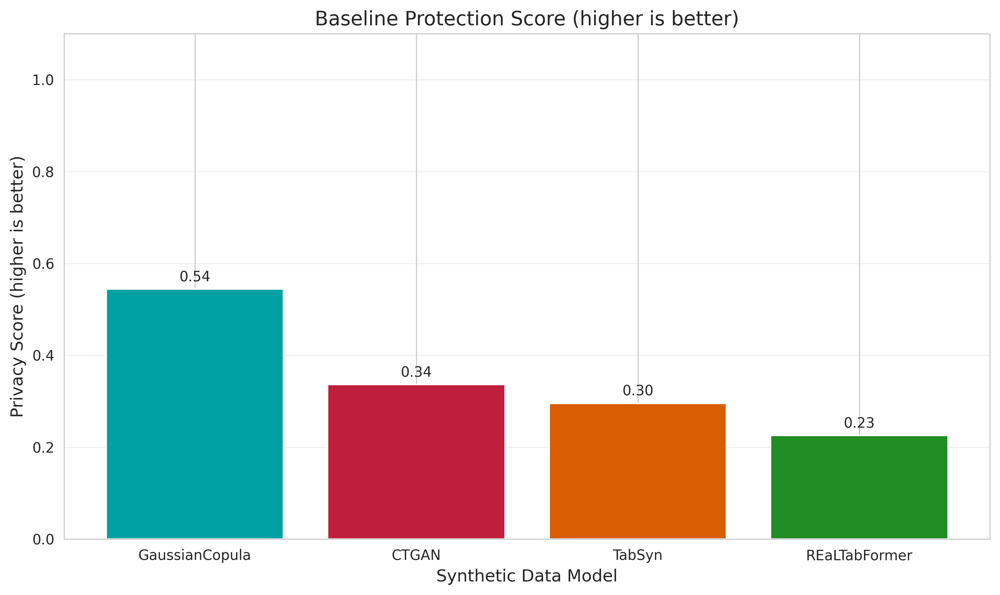
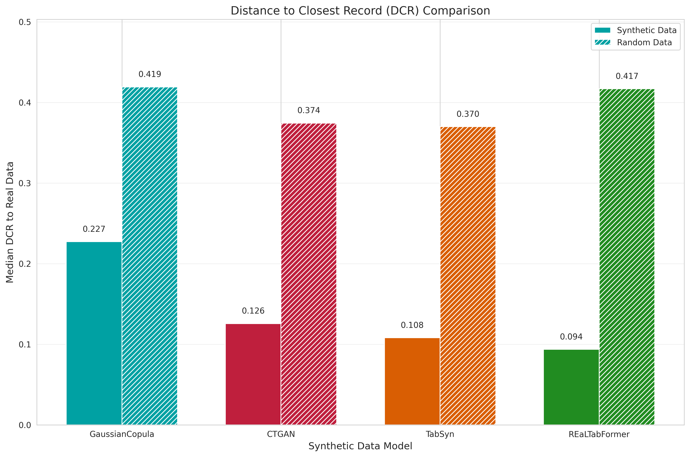
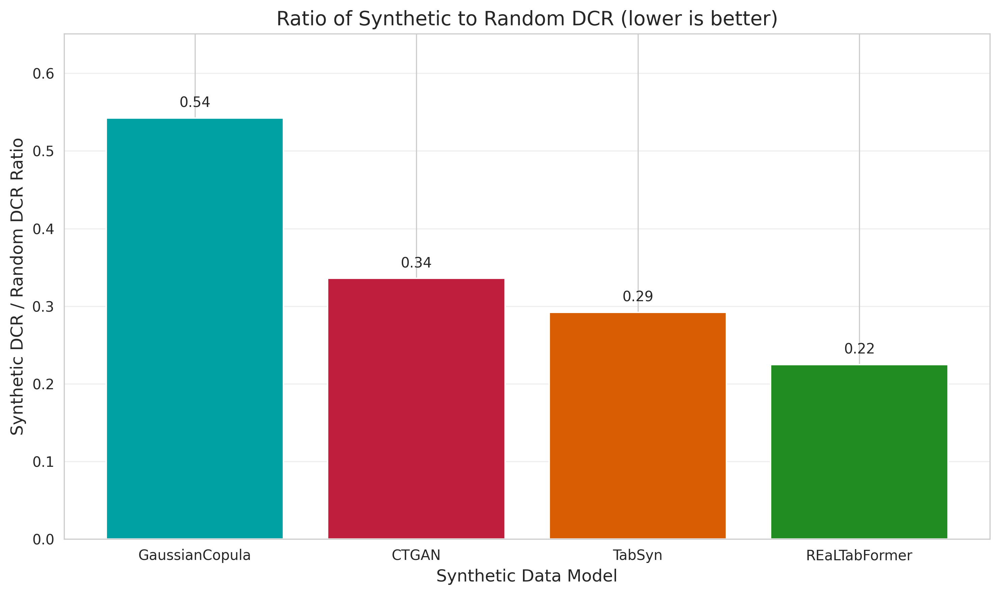
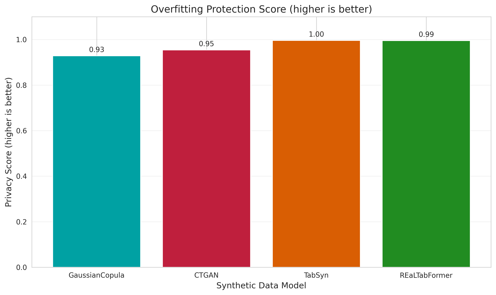
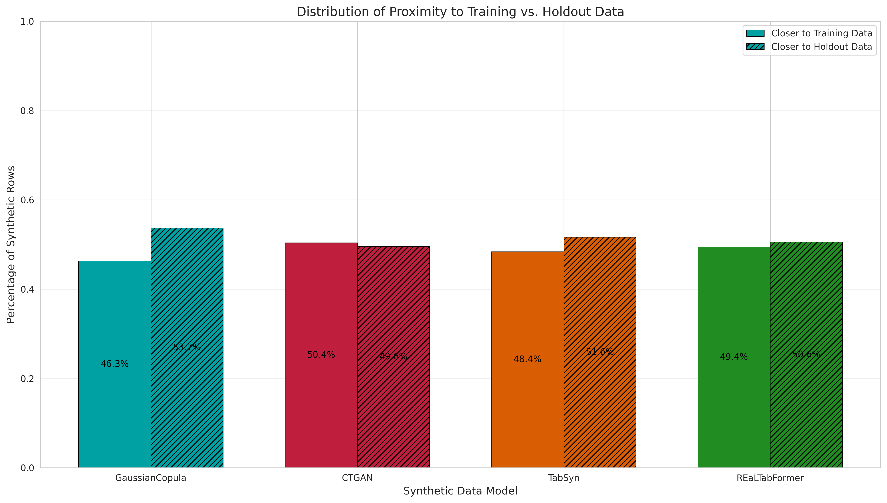
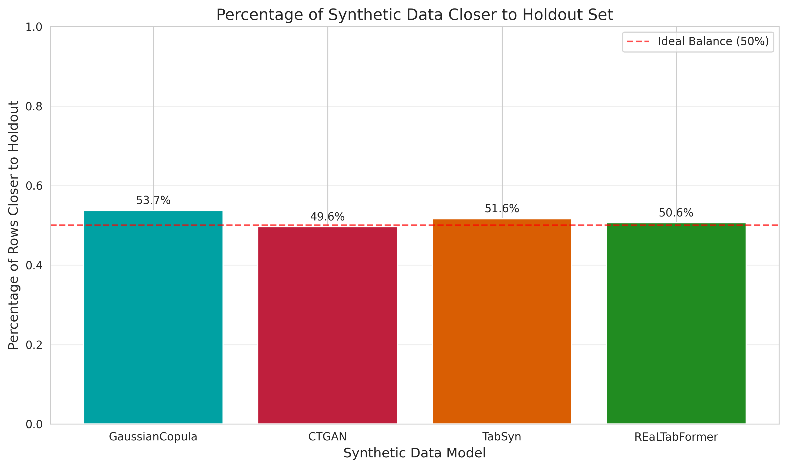
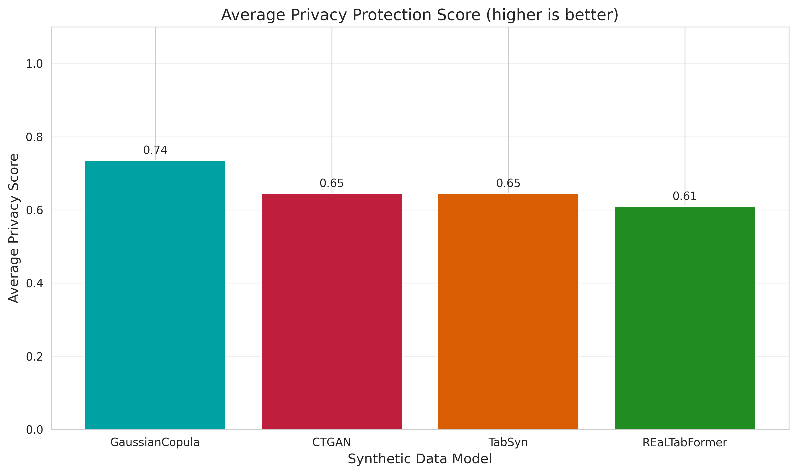
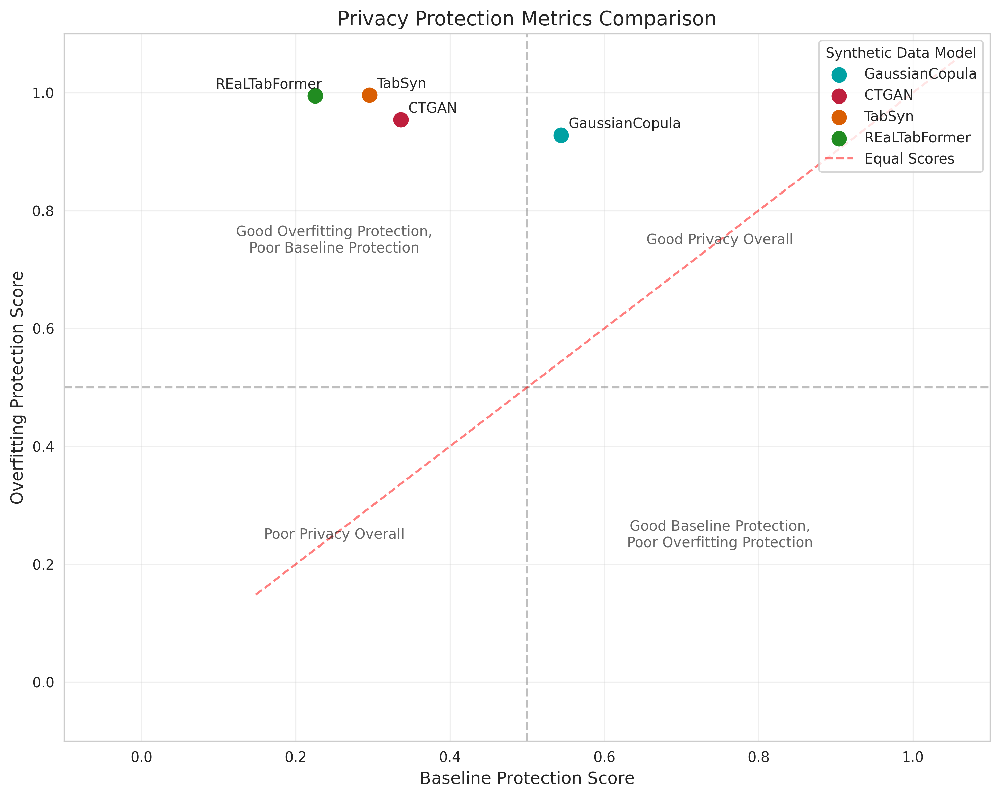
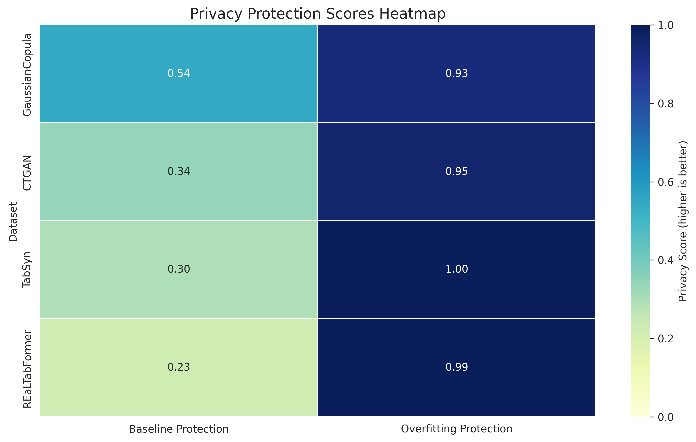

# Privacy Evaluation of Synthetic Flight Data

## Executive Summary
We evaluated four synthetic flight data generators (GaussianCopula, TabSyn, CTGAN, and REaLTabFormer) using two complementary privacy metrics. GaussianCopula offers the best overall privacy protection with balanced performance across both metrics. CTGAN excels specifically at preventing overfitting but provides weaker general privacy protection. All models show room for improvement in baseline privacy protection.

## Introduction to Privacy Metrics

Privacy in synthetic data requires balancing two key aspects: ensuring synthetic records don't reveal sensitive information from real data while still maintaining utility. Our evaluation uses two Distance-to-Closest-Record (DCR) metrics that measure different privacy dimensions.

Privacy in synthetic data requires balancing two key aspects: ensuring synthetic records don't reveal sensitive information from real data while still maintaining utility. Our evaluation uses two Distance‑to‑Closest‑Record (DCR) metrics that measure different privacy dimensions.

### Distance-to-Closest-Record (DCR) Explained
DCR measures how close each synthetic record is to its nearest neighbor in real data. Larger distances indicate better privacy protection, as synthetic records are less likely to reveal information about specific real records.

### Our Two Privacy Metrics

1. **Baseline Protection** (`DCRBaselineProtection`):  
   Compares synthetic data's distance from real data against random data's distance.
   
   <!-- $$\text{Score} = \min\left(\frac{\text{median DCR}_{\text{synthetic}}}{\text{median DCR}_{\text{random}}},\, 1.0\right)$$ -->
   
   * **Higher scores** (closer to 1.0) mean synthetic data is nearly as distant from real data as random noise would be, indicating stronger privacy.
   * **Lower scores** suggest synthetic records remain suspiciously close to real records, potentially leaking private information.

2. **Overfitting Protection** (`DCROverfittingProtection`):  
   Measures whether synthetic data is disproportionately similar to training data compared to unseen holdout data.
   
   <!-- $$\text{Score} = \min\left(2 \times (1 - p_{\text{closer\_to\_training}}),\, 1.0\right)$$ -->
   
   * **Higher scores** (closer to 1.0) indicate synthetic data doesn't memorize training data.
   * **Balanced proximity** (around 50% closer to training, 50% closer to holdout) is ideal.
   * **Lower scores** suggest overfitting, where the model effectively memorizes and reproduces training records.

All DCR calculations normalize each feature's contribution by its range, preventing features with larger numerical scales from dominating.

## DCR Baseline Protection Results

### Key Insights
- **GaussianCopula** provides the strongest baseline protection (0.54), generating records that are more difficult to link back to specific real records.
- **Realtabformer** offers the weakest protection (0.22), with synthetic records remaining noticeably close to real data points.
- No model exceeds 0.6, indicating all synthetic generators still produce data measurably closer to real records than pure random noise would be.
---

This comparison highlights the gap between synthetic and random data distances:
- Random data consistently maintains greater distance from real data (median DCR ≈ 0.37-0.41) 
- Synthetic data shows varying but closer proximity (median DCR ≈ 0.14-0.25)
- GaussianCopula produces the smallest gap between synthetic and random (0.2156), indicating better privacy protection
---

The ratio chart (synthetic DCR / random DCR) provides a normalized view:
- GaussianCopula's ratio (0.5353) is significantly higher than other models
- Realtabformer's ratio (0.2874) is concerning from a privacy perspective
- Ideal ratio would approach 1.0, indicating synthetic data as distant from real data as random noise
---
## DCR Overfitting Protection Results

### Key Insights
- **CTGAN** achieves perfect overfitting protection (1.0000), with balanced proximity to training and holdout data, suggesting it doesn't memorize specific records.
- **All models** score above 0.93, demonstrating strong resistance to overfitting—an encouraging result for privacy.
- CTGAN and GaussianCopula slightly favor holdout data, while TVAE and Realtabformer very slightly favor training data.
---

The side-by-side comparison reveals:
- All models hover near the ideal 50/50 split, indicating limited memorization of training data
- The pattern is consistent across all generators, suggesting that modern synthetic data techniques effectively avoid extreme overfitting
---

## Combined Privacy Evaluation

---

The scatter plot effectively maps the privacy landscape:
- **Upper-right quadrant** (>0.5 on both metrics): Only GaussianCopula achieves this balanced privacy protection
- Other models cluster in the "good overfitting protection, weaker baseline protection" quadrant
- Distance from the diagonal red line indicates imbalance between the two privacy metrics
- Ideal models would position in the top-right corner (1.0, 1.0)
---

The heatmap offers a compact reference of all scores, clearly showing:
- The consistent strength across all models in overfitting protection (all dark blue)
- The significant variation in baseline protection (ranging from light to medium blue)
- GaussianCopula's leadership in overall balanced privacy
---

